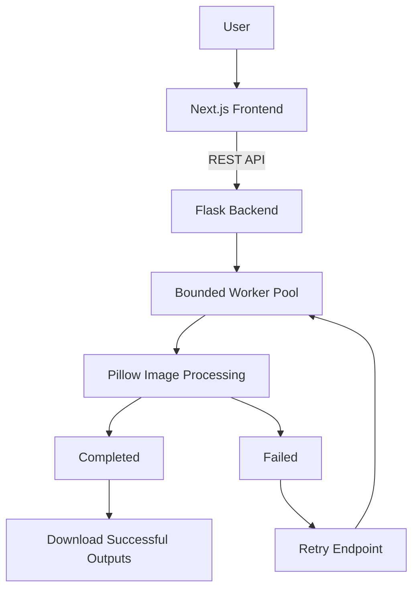

# BatchFlow Frontend

A focused proof-of-work for **reliable batch image processing with partial failure recovery**.

**Live demo:** https://batchflow-frontend-steel.vercel.app/  
**Frontend repository:** https://github.com/ajayyadavexpo/batchflow-frontend  
**Backend repository:** https://github.com/ajayyadavexpo/batchflow-backend

---

## Why I built this

In a multi-file processing workflow, one failed file should not force the user to restart the entire batch.

BatchFlow explores a small but important reliability problem:

> **Preserve successful work, isolate failures, and retry only what failed.**

The goal was not to build a large image-editing product. The goal was to build a small, production-style proof-of-work that demonstrates product thinking, frontend/backend integration, failure handling, and user-visible recovery.

---

## What the frontend does

- Upload multiple JPG, PNG, and WEBP images
- Create a batch through the Flask API
- Poll live batch status
- Show per-file state:
  - `pending`
  - `processing`
  - `completed`
  - `failed`
- Show overall batch progress
- Show input/output file sizes
- Show compression savings
- Retry one failed file
- Retry all failed files
- Preserve successful outputs during retries
- Download successful outputs as a ZIP
- Demonstrate a deterministic fail-once retry flow

---

## Demo flow

The easiest way to see the core idea:

1. Upload 4-6 images
2. Enable **Demo retry flow**
3. Start processing
4. One image intentionally fails once
5. The remaining images continue processing normally
6. Retry the failed image
7. The retry succeeds on **Attempt 2**
8. Download the successful outputs

This demonstrates that the batch is resilient to partial failure.

---

## Architecture



---

## Frontend stack

- **Next.js**
- **React**
- **TypeScript**
- **CSS**
- Browser `fetch`
- Vercel

The UI intentionally stays dependency-light so the product logic is easy to understand and explain.

---

## Backend API used

The frontend talks to the Flask backend through:

```text
POST   /api/batches
GET    /api/batches/:batchId
POST   /api/batches/:batchId/retry
POST   /api/files/:fileId/retry
GET    /api/batches/:batchId/download
```

---

## Batch lifecycle

```text
pending
   ↓
processing
   ↓
┌───────────────────┐
│                   │
completed     partial_failure
                     │
                     ↓
                  retry
                     │
                     ↓
                processing
```

A file follows:

```text
pending → processing → completed
                     ↘ failed → retry → processing
```

Successful files are not reprocessed when failed files are retried.

---

## Local setup

### 1. Clone the frontend

```bash
git clone https://github.com/ajayyadavexpo/batchflow-frontend.git
cd batchflow-frontend
```

### 2. Install dependencies

```bash
npm install
```

### 3. Create the environment file

Create `.env.local`:

```env
NEXT_PUBLIC_API_BASE_URL=http://127.0.0.1:5000
```

### 4. Start the Flask backend

Backend repository:

https://github.com/ajayyadavexpo/batchflow-backend

Make sure it is running on:

```text
http://127.0.0.1:5000
```

### 5. Start the frontend

```bash
npm run dev
```

Open:

```text
http://localhost:3000
```

---

## Production deployment

The frontend is deployed on **Vercel**:

https://batchflow-frontend-steel.vercel.app/

Production environment variable:

```env
NEXT_PUBLIC_API_BASE_URL=https://batchflow-api-ihb4.onrender.com
```

---

## Important UX decisions

### Preserve successful work

If 1 out of 10 files fails, the other 9 remain completed.

The user does not have to restart the entire batch.

### Make failure visible

Every file has its own status and error state.

This makes the system easier to understand and recover from.

### Retry only failed work

The UI supports:

- retry one failed file
- retry all failed files

Completed files are intentionally left untouched.

### Keep the workflow simple

The project focuses on one problem:

> reliable multi-file processing

It avoids unrelated features such as authentication, billing, AI editing, or large dashboard functionality.

---

## What I would improve for production

For a larger production system, I would consider:

- Server-Sent Events or WebSockets instead of polling
- Authentication and per-user batch ownership
- Direct-to-object-storage uploads
- Signed download URLs
- Persistent object storage
- Batch pagination
- Resumable uploads
- Accessibility improvements
- Automatic retention/cleanup policies
- Analytics around failure causes and retry success rates

These were intentionally left out of the proof-of-work to keep the scope focused.

---

## What this project demonstrates

This project is intentionally small, but it exercises several full-stack concerns:

- product-oriented problem selection
- API integration
- asynchronous state handling
- failure recovery
- polling
- status modelling
- file upload UX
- download flows
- error states
- retry behaviour
- deployment across separate frontend/backend services

---

## Related repository

Backend:

https://github.com/ajayyadavexpo/batchflow-backend

---

## Author

**Ajay Yadav**

Built as a focused proof-of-work around reliable batch file-processing workflows.
